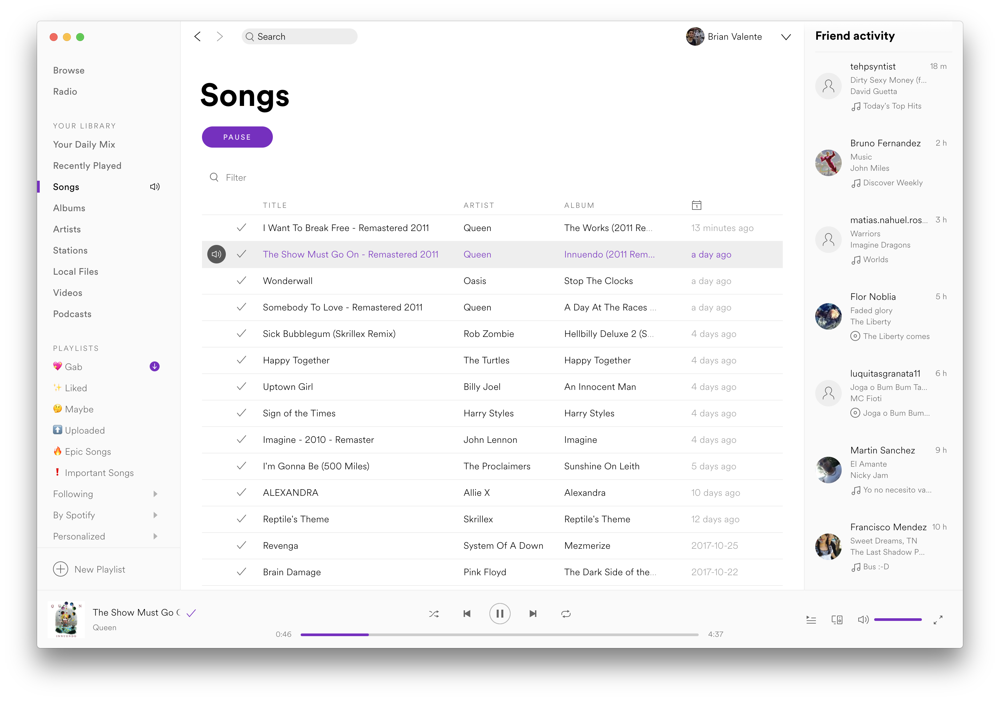

# LightPurple Theme for Spotify

## How to install

Use the [theme installer](https://github.com/BrianValente/SpotifyDesktop-ThemeInstaller) to install this.

Alternatively, you can download the latest release [from here](https://github.com/BrianValente/SpotifyDesktop-LightPurple/releases) and replace the files in your Apps folder.

On macOS the Apps folder is inside the app: /Applications/Spotify.app/Contents/Resources/Apps.

On Windows the Apps folder is located in C:\Users\<username>\AppData\Roaming\Spotify\Apps.